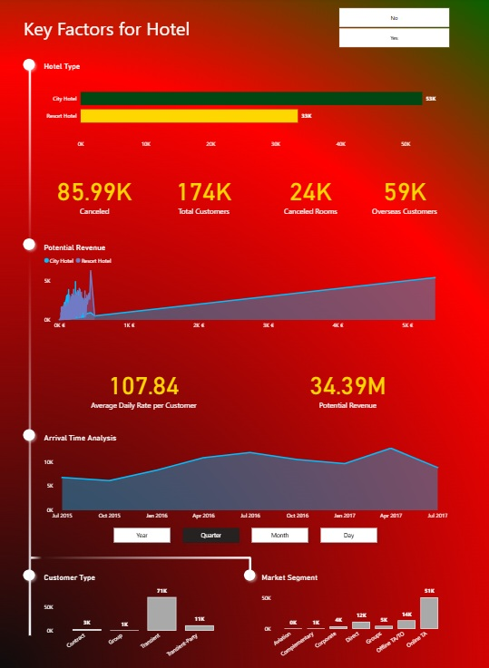
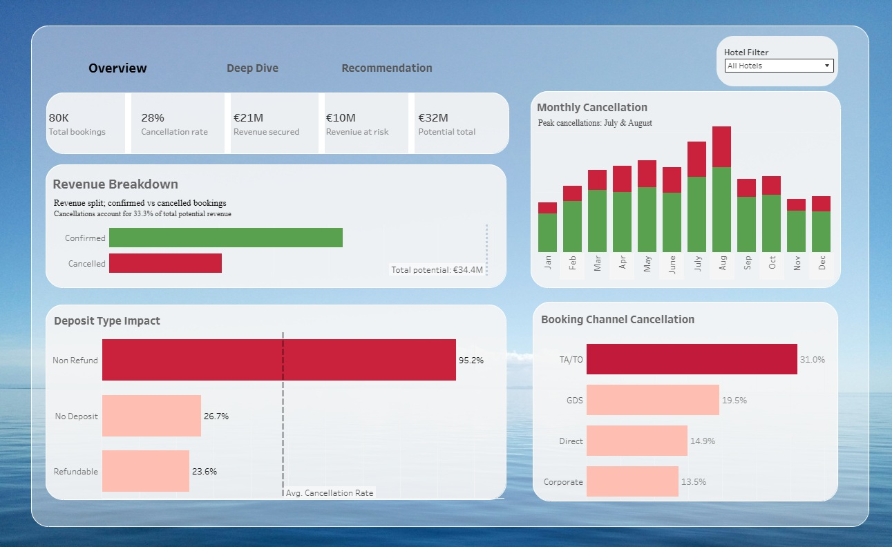

# 🏨 Hotel Reservation Cancellation Predictions in Portugal

> Predicting hotel booking cancellations using machine learning to reduce revenue loss and support smarter overbooking strategies.

**Group Project** | Purwadhika Digital Technology School — JCDSOL-015
Team: Mochamad Aditya P. Y. K · Tamara Puspita Ayu · Yoga Lafrianto

---

## 📊 Dashboard Preview

> **Power BI Dashboard**
> 📎 [View on Google Drive](https://drive.google.com/file/d/1q71xAqTkJ28e35QRMruEUWXb78h8ZcB4/view?usp=sharing)
> 

> **Tableau Dashboard**
> 📎
> 📎 [View Interactive Tableau Dashboard](https://public.tableau.com/views/HotelReservationCancellationPredictionsinPortugal_dash/Dashboard1?:language=en-US&publish=yes&:sid=&:redirect=auth&:display_count=n&:origin=viz_share_link)

---

## 📋 Table of Contents

- [Problem Statement](#problem-statement)
- [Project Objectives](#project-objectives)
- [Dataset Overview](#dataset-overview)
- [Methodology](#methodology)
- [Model Results](#model-results)
- [Business Impact](#business-impact)
- [Key Findings & Recommendations](#key-findings--recommendations)
- [Tech Stack](#tech-stack)
- [Repository Structure](#repository-structure)

---

## Problem Statement

Hotel cancellations represent one of the most costly operational challenges in the hospitality industry. When cancellations go unpredicted, hotels face two equally damaging outcomes: empty rooms that generate zero revenue, or aggressive overbooking that damages guest experience and reputation.

Between 2015–2017, Portugal's hotel industry experienced significant growth driven by rising international tourism. Yet cancellation rates remained high, with missed predictions translating directly into lost revenue and operational inefficiency.

This project builds a machine learning model to predict which bookings are likely to be cancelled. Enabling hotel management to act early, adjust overbooking strategies, and protect revenue before losses occur.

---

## Project Objectives

- Build a classification model that outperforms the rule-based baseline (F1-score: 0.48)
- Identify the key features that most influence cancellation decisions
- Quantify the financial impact of missed cancellation predictions (false negatives)
- Deliver findings through interactive dashboards for management decision-making

---

## Dataset Overview

| Item | Detail |
|---|---|
| Source | [Kaggle — Hotel Booking Demand](https://www.kaggle.com/datasets/jessemostipak/hotel-booking-demand/data) \| [ScienceDirect](https://www.sciencedirect.com/science/article/pii/S2352340918315191) |
| Raw records | 119,390 rows |
| Cleaned records | 85,991 rows |
| Target variable | `is_canceled` (0 = not cancelled, 1 = cancelled) |
| Class imbalance | ~37% cancellation rate |
| Period covered | 2015 – 2017 |
| Hotel types | City Hotel, Resort Hotel |

### Key Features

| Feature | Description |
|---|---|
| `lead_time` | Days between booking and check-in date |
| `adr` | Average Daily Rate - revenue per room per night |
| `market_segment` | Booking channel (Direct, Online TA, Corporate, etc.) |
| `deposit_type` | No Deposit / Refundable / Non-Refundable |
| `stays_in_week_nights` | Number of weekday nights booked |
| `stays_in_weekend_nights` | Number of weekend nights booked |
| `is_repeated_guest` | Whether the guest has stayed before |
| `previous_cancellations` | Number of prior cancellations by the customer |
| `total_of_special_requests` | Number of special requests made |

---

## Methodology

### 1. Data Cleaning
- Handled missing values, duplicates, anomalies, and data leakage
- Removed outliers to improve model robustness
- Final dataset: 85,991 cleaned records

### 2. Exploratory Data Analysis (EDA)
- Analyzed cancellation patterns by market segment, season, lead time, and deposit type
- Identified key behavioral differences between cancelling and non-cancelling guests
- Visualized findings across hotel type, booking channel, and arrival period

### 3. Baseline Model (Rule-Based)
- Built a rule-based model using the two highest-correlated features: `lead_time` and `market_segment`
- Result: **F1-score of 0.48**; established as the benchmark to beat

### 4. Resampling Strategy
Addressed class imbalance by testing 10 resampling techniques:

**Oversampling:** Random Oversampling, SMOTE, ADASYN, KMeans SMOTE, Borderline SMOTE

**Undersampling:** Random Undersampling, NeighbourhoodCleaningRule, NearMiss v1, NearMiss v2, TomekLinks

➡ **Borderline SMOTE** produced the highest F1-score on Logistic Regression and was selected for full model comparison.

### 5. Model Comparison
Tested 6 classifiers using Borderline SMOTE:

| Model | F1 Train | F1 Test |
|---|---|---|
| Logistic Regression | 0.61 | 0.60 |
| KNeighbors Classifier | 0.63 | 0.61 |
| Gradient Boosting Classifier | 0.67 | 0.66 |
| AdaBoost Classifier | 0.64 | 0.63 |
| LightGBM Classifier | 0.66 | 0.65 |
| **XGBoost Classifier** | **0.669** | **0.677** ✅ |

### 6. Hyperparameter Tuning
Applied **Bayesian Optimization** to XGBoost:

| Metric | Before Tuning | After Tuning |
|---|---|---|
| F1 Train | 0.669 | 0.677 |
| F1 Test | 0.677 | **0.688** ✅ |
| Precision (class 1) | 0.73 | 0.73 |
| Recall (class 1) | 0.64 | 0.65 |
| Accuracy | 0.83 | 0.84 |

---

## Business Impact

### Revenue Risk from False Negatives

False Negatives (FN) are the most costly model errors; cancellations that actually occurred but the model failed to predict. These represent bookings where the hotel was caught off-guard with no time to resell the room.

```
Revenue at Risk = FN × ADR × Average Length of Stay

= 1,669 missed cancellations
× €107.84 (mean ADR)
× 3.66 nights (avg. weekend + weekday stay)

= €658,079 estimated revenue at risk
```

### Confusion Matrix Results

| | Predicted: No Cancel | Predicted: Cancel |
|---|---|---|
| **Actual: No Cancel** | TN: 11,297 ✅ | FP: 1,134 ⚠️ |
| **Actual: Cancel** | FN: 1,669 ❌ | TP: 3,099 ✅ |

**False Positives (1,134)** also carry a cost guests flagged as likely to cancel but who actually showed up. Acting on these predictions aggressively (e.g. overselling rooms) risks turning away real guests, damaging hotel reputation.

### Overall Financial Context
- Revenue from non-cancelled bookings: **€22,930,425**
- Potential revenue lost to cancellations: **€11,456,861**
- Cancellations represent **33.32%** of total potential revenue

---

## Key Findings & Recommendations

### Top Cancellation Drivers (Feature Importance)

1. **Market Segment (Online TA)** - Guests booking via Online Travel Agents cancel at significantly higher rates
2. **Required Car Parking Spaces** - Guests not requiring parking cancel more frequently
3. **Deposit Type (Non-Refundable)** - Counterintuitively, non-refundable deposits correlate with higher cancellation intent
4. **International vs. Domestic Guests** - International guests cancel less frequently than domestic guests

### Recommendations for Hotel Management

**To reduce False Negatives (missed cancellations → empty rooms):**
- Implement a tiered cancellation policy:
  - >7 days before check-in: full refund
  - 3–7 days before: partial refund (50%)
  - <3 days / same day: no refund
- Offer last-minute pricing on vacant rooms through OTA platforms
- Target corporate and group bookings which show lower cancellation rates

**To reduce False Positives (unnecessary overbooking):**
- Use model predictions as a guide, not a trigger. Combine with historical cancellation rates per season
- Establish partnerships with nearby hotels to handle relocation efficiently if overbooking occurs
- Prepare guest compensation protocols (upgrades, discounts) to protect reputation

**Seasonal strategy:**
- July and August show the highest cancellation volumes, apply stricter policies during peak season
- Off-peak periods benefit from flexible promotions and last-minute deals to recover lost occupancy

---

## Tech Stack

| Category | Tools |
|---|---|
| Language | Python |
| Data Manipulation | Pandas, NumPy |
| Visualization | Matplotlib, Seaborn |
| Machine Learning | Scikit-learn, XGBoost, LightGBM |
| Resampling | Imbalanced-learn (SMOTE, ADASYN, BorderlineSMOTE) |
| Hyperparameter Tuning | Bayesian Optimization (Optuna / Scikit-Optimize) |
| BI & Dashboards | Power BI, Tableau |
| Environment | Google Colab |
| Version Control | GitHub |

---

## Repository Structure

```
Hotel-Reservation-Cancellation-Predictions-in-Portugal/
│
├── Fi_Pro_Beta.ipynb                        # Main notebook
├── Hotel Booking Cancellation Dashboard.pbix # Power BI dashboard
├── Hotel_Bookings_Cleaned.xlsx              # Cleaned dataset
├── Hotel_Bookings_Cleaned_Canceled.xlsx     # Cancelled bookings subset
├── Hotel_Bookings_Cleaned_Not_Canceled.xlsx # Non-cancelled bookings subset
├── hotel_bookings.csv                       # Raw dataset
├── pipeline_xgb_tuned.joblib               # Saved tuned XGBoost model
└── README.md
```

---

## 🔗 Links

| Resource | Link |
|---|---|
| 📓 Notebook (Google Colab) | [Open Notebook](https://colab.research.google.com/drive/1vgdbcMkygOm8bZQcYS1MVrx6550NtOYy) |
| 📊 Power BI Dashboard | [View on Google Drive](https://drive.google.com/file/d/1q71xAqTkJ28e35QRMruEUWXb78h8ZcB4/view?usp=sharing) |
| 📁 Dataset (Kaggle) | [Hotel Booking Demand](https://www.kaggle.com/datasets/jessemostipak/hotel-booking-demand/data) |
